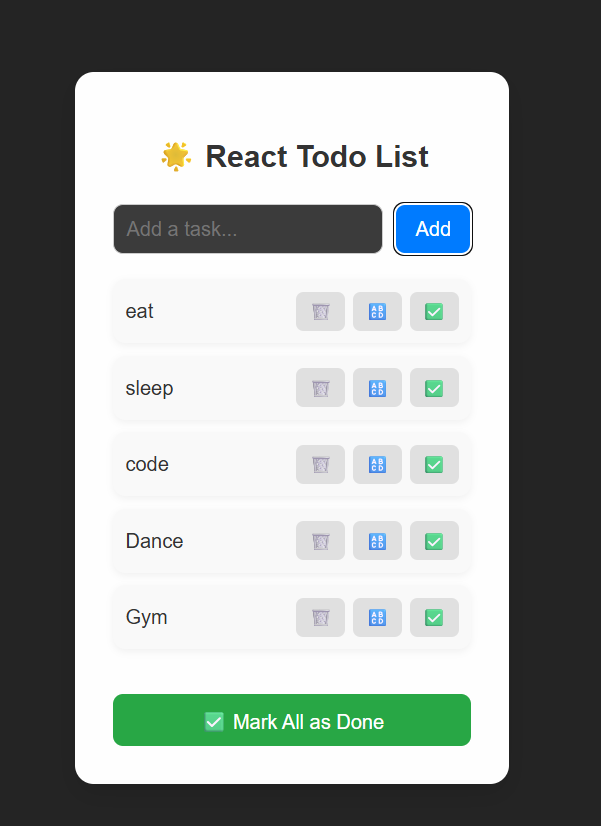

“I made a responsive React ToDo app that allows users to add, mark, and delete tasks, including a ‘Mark All as Done’ feature. The UI is clean with custom CSS and icon buttons for a better experience.”

well, there are many other files in i too...as when I was learning react in that file only , I made this project so before forking or cloning , keep that in mind..Thanks
